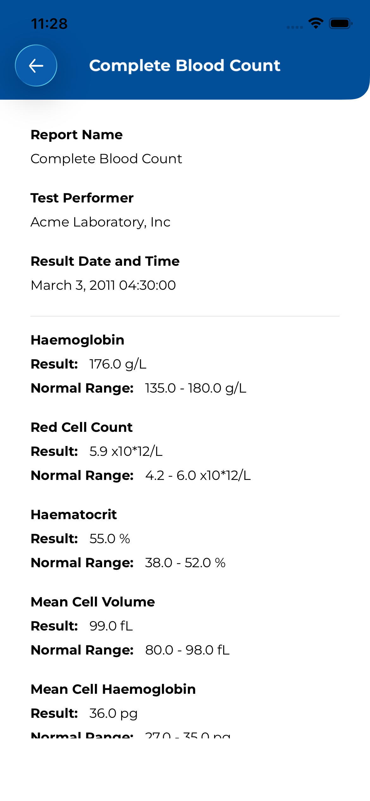

# NS Health Take Home

## Setup

1. Clone the repository.  
2. Open `NSHealthTakeHome.xcodeproj` in Xcode 16.4.  
3. Build & run on an iOS 18.5 simulator.  

---
## Specifications
- **Xcode**: 16.4  
- **iOS Target**: 18.5  

---

## Project Structure

The project is organized into modular components to maximize reuse and consistency:

### App Resources
- **Reusable Components**: App-specific UI elements for a consistent design language.  
- **States**: Enum-based state management (`idle`, `loading`, `success`, `failure`) to keep UI reactive and predictable.  
- **Constants**:  
  - **Fonts** – consistent typography with Dynamic Type support.  
  - **Colors** – centralized palette for light/dark mode.  
  - **Dimensions** – spacing, paddings, corner radii, etc.  
  - **Strings** – app-wide constants to make localization easy.  
  - **Images** – asset references in one place.  
- **NetworkModule**: Async/await networking built on `URLSession`, decoding responses with `Codable`.  
- **DateFormatter**: Centralized formatters for consistency.  

### Modules 
  - `AppRoute`  
  - `RootView`  
     - `HomeView`  
     - `RecordsView`  
         - `DiagnosticRecordsView`  
         - `RecordDetailsView`  

---

## Assumptions and Features
 
- **MVVM chosen over TCA**: lightweight, no external dependencies, still modular and testable.  
- **Codable** for parsing: native, simple, covers current use cases.  
- **SwiftLint** configured locally (not blocking builds).  
- **Async/await** used instead of closures for modern concurrency.  
- Supports **Dark Mode**.  
- Accessibility considered through **Dynamic Type** (fonts), with future plans for VoiceOver and color contrast compliance.  
- No external libraries required at this stage.  
- UI and components designed with placeholder assumptions where final design is missing.  
- Unit tests currently cover core components (**NetworkModule**, **ViewModels**, **Repository**); other areas pending.  
- Ready for **Liquid Glass**.

---

## API Considerations

- Only usable keys are decoded from responses.  
- Assumes 3 known response types plus an `unknown` fallback case to support backend changes in `diagnosticreport-example.json` for `resourceType` 
- Error handling:  
  - Unknown or missing values → show default message or hide section to avoid broken UI.  

---

## Architecture

### Pattern: **MVVM + Router**

- **View**  
  - SwiftUI `View` bound to a `ViewModel` via `@StateObject` or `@ObservedObject`.  
  - Reacts to `ViewState` (`idle`, `loading`, `success`, `failure`).  

- **ViewModel**  
  - Injected with a `Repository` dependency (for testability).  
  - Contains business logic and exposes results via `@Published state`.  
  - Example: `LabAndDiagnosticsViewModel` fetches data and updates state.  

- **Model**  
  - Represents business entities (`DiagnosticReportBundle`).  
  - Manipulated/extended as per module needs.  

- **Repository**  
  - Handles networking and data parsing.  
  - Uses `URLSession + async/await` and `Codable` for decoding.  

- **Router**  
  - Abstracts navigation logic using `NavigationStack` and `EnvironmentObject`.  
  - Keeps navigation concerns out of Views (UI) and ViewModels (business logic).  
  
- **Diagram Representation**  

---

## Future Considerations
- **Tests**: Broader coverage including UI and integration tests.  
- **Security**: Add encryption, authentication, CAPTCHA as needed.  
- **Accessibility**: Full VoiceOver support for visually impaired users.  
- **Modularity**: Extract each module into its own Swift Package (SPM).  
- **CI/CD**: Automated pipelines for build, test, and distribution.  
- **Analytics**: Integrate event tracking.  
- **Logging**: Structured logging for debugging/monitoring.  
- **Environments**: Separate dev, staging, and production.  
- **Localization**: Simplified by centralized constants.  
- **Dependencies**: Currently none, but flexible for future integration.  

---

## Screens / Demos

- **App Screens**

- **App Navigation** 

- **App Navigation with Loading State**  

- **Dark Mode**  

- **Accessiblity**  

- **Liquid Glass**  

---
